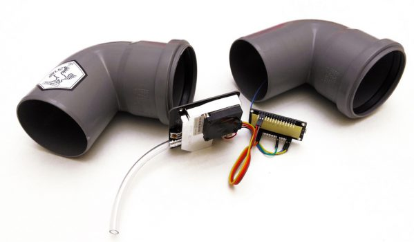
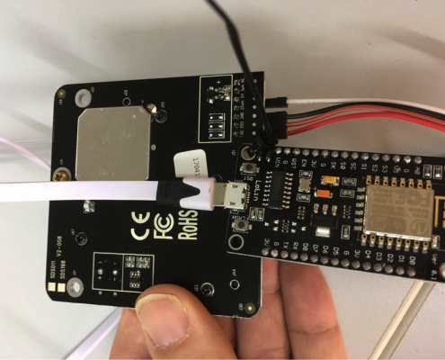
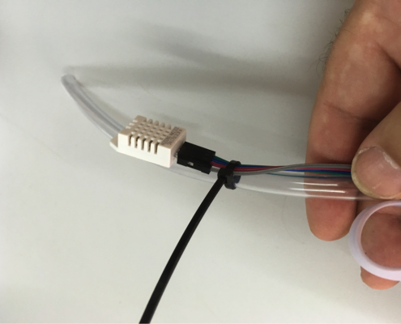
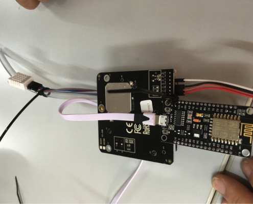
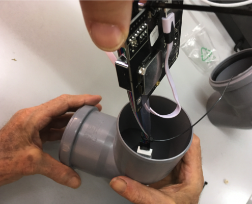
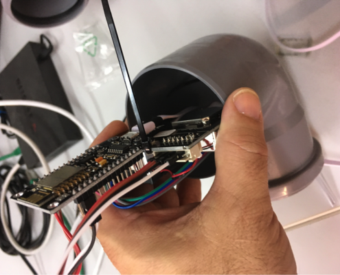
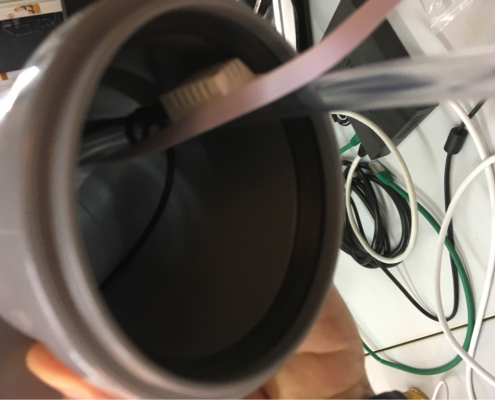
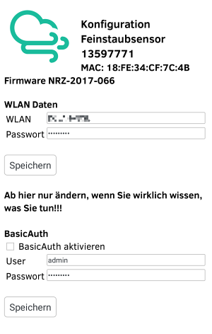

*This is an English translation of http://luftdaten.info/feinstaubsensor-bauen/*

# Particulate matter sensor - construction manual
## Shopping list

-  [NodeMCU ESP8266, CPU / WLAN](https://de.aliexpress.com/w/wholesale-nodemcu-v3-esp8266-ch340.html?spm=2114.010208.0.0.2zt6Ca&initiative_id=SB_20170101021508&site=deu&groupsort=1&SortType=price_asc&g=y&SearchText=nodemcu+v3+esp8266+ch340)
- [SDS011 particulate matter sensor (formerly PPD42NS)](http://de.aliexpress.com/wholesale?site=deu&SortType=price_asc&shipCountry=de&SearchText=sds011&CatId=523)
- [DHT22, temperature & humidity (optional)](http://de.aliexpress.com/wholesale?site=deu&SortType=price_asc&shipCountry=de&SearchText=dht22&CatId=523)
-  [small cable](http://de.aliexpress.com/item/Free-Shipping-80pcs-dupont-cable-jumper-wire-dupont-line-female-to-female-dupont-line-20cm-1P/701588771.html)
-  [USB cable eg: flat micro USB power adapter USB](http://de.aliexpress.com/wholesale?catId=0&initiative_id=SB_20160828005508&SearchText=micro+usb+kabel+flach) 
- cable ties 
- piping, if possible not transparent, diameter 6 mm , length ca. 20cm (hardware store) 
- weather protection, Marley Silent HT bend ( [DN 75 87 °](https://www.bauhaus.info/rohrsysteme/marley-ht-bogen-/p/13625028) )
## Assemble
The assembly is designed in a way that everyone can join. With only 7 cords and 2 cable ties, the kit becomes a measuring station. Really easy!

## Measure particulate matter

# Import firmware
Here the firmware is played on the NodeMCU

## Introductory words
You do not have to program, do not worry!

We have already finished programming the firmware. It is only dubbed and installed on the NodeMCU (ESP8288). This is also for computer laymen to do.
If you need help, just come by our appointments:

Every  2nd Tuesday of the month , 7 pm,  shackspace , Ulmer Str. 255, Stuttgart Wangen

## Install USB2SERIAL driver
To communicate with the ESP8266, you need usb2serial drivers. The chipset is normally CH341 for NocdeMCUs: driver side of the manufacturer (chinese).

* Linux: no installation required, chip should be supported directly (with dmesg verifiable)
* MacOS: for Sierra see these successfully tested instructions:  https://github.com/adrianmihalko/ch340g-ch34g-ch34x-mac-os-x-driver
* Windows: TBA (possibly manufacturer driver try, so)
* Raspberry Pi: https://github.com/aperepel/raspberrypi-ch340-driver

## Import firmware
Instructions for copying

Who does not dare, please look in the FAQ's . There is a video tutorial.

### Install Arduino software, import firmware
* Download & install the Arduino software on the computer:  https://www.arduino.cc/en/Main/Software
* In the settings in the field "Additional Board Manager URLs" insert this URL: http://arduino.esp8266.com/stable/package_esp8266com_index.json
* Under "Tools -> Board ... -> Board Administrator" search for "esp8266" and install "esp8266 by ESP8266 Community"
* Arduino IDE quit (at the latest before flashing)
* Download the German firmware  https://www.madavi.de/sensor/update/data/latest_en.bin
other languages:
* Bulgarian: https://www.madavi.de/sensor/update/data/latest_bg.bin
* English: https://www.madavi.de/sensor/update/data/latest_en.bin
* French: https://www.madavi.de/sensor/update/data/latest_fr.bin
* Italian: https://www.madavi.de/sensor/update/data/latest_it.bin
* Spanish: https://www.madavi.de/sensor/update/data/latest_es.bin
* Portuguese: https://www.madavi.de/sensor/update/data/latest_pt.bin
* Dutch: https://www.madavi.de/sensor/update/data/latest_nl.bin
* Connect the NodeMCU to the computer. If possible, with a USB2.0 cable to a USB2.0 port, as the NodeMCU may not be recognized under Windows. 
**Attention**: When copying to the NodeMCU, use a USB cable not more than 1m in length. 
#### Windows 
* Open the command line (cmd.exe) under Windows
* Windows:% USERPROFILE% \ AppData \ Local \ Arduino15 \ packages \ esp8266 \ tools \ esptool \ 0.4.9 \ esptool.exe -vv -cd nodemcu -cb 57600 -ca 0x00000 -cp COM11 -cf path to the downloaded_firmware file (the port behind, cp 'may need to be adjusted)
* The appropriate port can be found, for example, by connecting the NodeMCU to the desired port (see note above) and then starting the Arduino IDE. Under, Tools -> Port 'are the available port to see, usually quite easily the port with the NodeMCU recognizable. Or select a port and then run Tools - Get Board Information. If the correct port is selected, codes will appear at VID and PID. Close the IDE afterwards, otherwise this port is blocked.

#### Mac / Linux

* Linux / MacOS open the terminal
* Linux: ~ / .arduino15 / packages / esp8266 / tools / esptool / 0.4.9 / esptool -vv -cd nodemcu -cb 57600 -ca 0x00000 -cp /dev/cu.wchusbserial1410 -cf path to the downloaded_firmware  file  (the port behind, -cp ' may need to be adjusted)
* MacOS: ~ / Library / Arduino15 / packages / esp8266 / tools / esptool / 0.4.9 / esptool -vv -cd nodemcu -cb 57600 -ca 0x00000 -cp /dev/cu.wchusbserial1410 -cf path to the downloaded_firmware  file  (the port behind, -cp may need to be adjusted)
* In case of problems you should try to execute the above command as root. Then in the path, ~ / 'must be replaced by the home directory.
* The appropriate port can be found, for example, by connecting the NodeMCU to the desired port (see note above) and then starting the Arduino IDE. Under, Tools -> Port 'are the available port to see, usually quite easily the port with the NodeMCU recognizable. Select a port and then run Tools -> Get Board Information. If the correct port is selected, codes will appear at VID and PID. Close the IDE afterwards, otherwise this port is blocked.
* For Linux there is a script in sensors-software / utils / flash /, which can also delete an existing configuration: 
https://github.com/opendata-stuttgart/sensors-software/tree/master/utils/flash

# ASSEMBLY OF THE ELECTRONICS
The electronic parts are switched together

## IMPORTANT NOTE
Before assembling the firmware play! 
See firmware loading .

If the firmware can not play on the NodeMCU, you do not have to put everything together again. It also reduces the risk of other connections being disconnected when plugging in and unplugging the USB cable.

## FITTING TOGETHER 
Note: Our instructions refer to version 3 of the NodeMCU. This can be recognized by the connections VU and G (see drawing). The versions have RSV at these ports. In these versions, the VIN ports can be used instead of VU and GND instead of G next to the MicroUSB port.

### Connection SDS011 
Pins are numbered from RIGHT to LEFT, make sure when connecting that the cables are really on the pins, as most Dupont cables also fit "next to" the pins 
SDS011 Pin 1 -> Pin D1 / GPIO5 
SDS011 Pin 2 -> Pin D2 / GPIO4 
SDS011 Pin 3 -> GND 
SDS011 Pin 4 -> unused 
SDS011 Pin 5 -> VU (NodeMCU v3) / VIN (NodeMCU v1, v2) 
SDS011 Pin 6 -> unused 
SDS011 Pin 7 -> unused

### Connection of the DHT22
Pins are numbered from LEFT to RIGHT, front side is the "grid" 
DHT22 Pin 1 -> Pin 3V3 (3.3V) 
DHT22 Pin 2 -> Pin D7 (GPIO13) 
DHT22 Pin 3 -> unused 
DHT22 Pin 4 -> Pin GND

### Electronic switch

The particulate matter sensor SDS011 and the temperature and humidity sensor DHT22 are connected with cables to the chip (NodeMCU).

## CONNECTION OF DISPLAYS AND OTHER SENSORS
In the FAQ, there is a list of supported sensors (eg BME280) and displays under 'Connecting other sensors'. Here is also described how they are connected.

# FINISH THE MEASURING STATION
The components are assembled together

## TIE TOGETHER
* Tie the NodeMCU (ESP8266) and the SDS011 sensor together with the first cable tie in such a way that the WLAN antenna points away from the sensor.
* Secure the temperature sensor DHT22 to the hose with the second cable tie.

## TIE TOGETHER
Thread the USB cable through the pipe
Install so that the SDS board is on top and the fan is down. Insert on the tube side without rubber seal.
Push the parts into the pipe so that the sensor clamps in the pipe.

## TIE TOGETHER
* Hose with USB cable from the tube end look.
* Slide the second elbow on the first one. Make sure that no cables are pinched.
* Position the temperature sensor on the hose so that it is just inside the pipe
* Cut the hose at the end of the pipe.
* Close the open ends of the pipes with a net, grid or similar, so that the air can circulate but the animals like beetles, spiders or the like stay outside.

# CONFIGURATION OF THE MEASURING STATION
The sensor connects to the W-LAN

## CONFIGURATION OF THE PARTICULATE MATTER SENSOR
* Connect the station with the power cable
* The station tries to connect to the configured WLAN access point. If this does not work, the sensor opens an access point with the name Particulate matter sensor ID, where ID is the ChipID (decimal, in the example below the 13597771).
* Connect to this access point. Wait a moment until the connection is made.
* Then in the browser the page http://192.168.4.1/ call, there the sensor can be configured: http://192.168.4.1/   -> Configure 
Please note: If the configuration of the sensor has worked, this page is no longer available 

[particulate matter assembly kit](Screenshot_20170318-234502.png)

Example: View of the sensor as a router with the number of the ESP8266
* Under 'Configure' enter the SSID (name of the home WLAN) and the network security key (under Windows) or enter the WLAN password of the home WLAN
* For particulate matter sensors according to this manual, nothing needs to be changed
* After saving, the sensor is restarted and can no longer be reached in this way
If no other changes have been made than entering the WLAN data, the sensor can be 'tested' after about 10 minutes on the following pages. Must be searched on these pages for the ChipID (in the example above the 13597771). 
Sensor data: http://www.madavi.de/sensor/graph.php
WLAN signal: http://www.madavi.de/sensor/signal.php
## LAST STEPS
To make the sensor part of the network, we still need some information

Email to rajko@codefor.de with the data:

* your ID of the ESP8266 (NodeMCU) -> comes as a number in the WLAN (fine dust sensor ...) or on the configuration page above
* your address: Street with house number, post code and city -> we make your coordinates (only rounded)
* the environment of the station - z. Height above ground, roadside, high traffic, open field or the like
* Your email address will not be published)
* If possible, an image where the sensor hangs - will not be published
If you prefer to transfer this data in a wacky manner, you can use the appropriate PGP key B1B3DC43 . It may happen that the email with the login is classified as spam. Then it may take a while for the sensor to register.
## NOTHING FOUND?
To the tutorials and the Frequently Asked Questions ...
